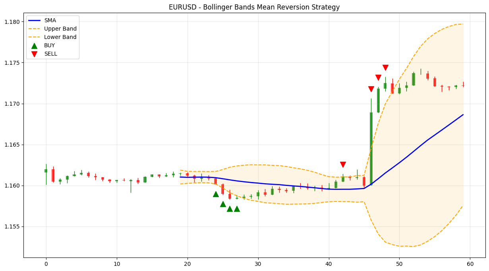

# 📊 Mean Reversion Trading Bot with Bollinger Bands  
> **A Python-based algorithmic trading system using mean reversion logic, Bollinger Bands, and real-time charting**

This repository contains a **complete, educational-grade mean reversion trading bot** that uses **Bollinger Bands** to identify potential buy and sell opportunities in the forex market. Built for clarity and learning, this bot connects to the **MetaSync API via RapidAPI**, fetches historical price data, applies a classic technical strategy, visualizes results, and generates trade signals.

Perfect for beginners and intermediate traders who want to understand:
- How mean reversion strategies work
- How to use Bollinger Bands algorithmically
- How to fetch real market data from an API
- How to visualize trading signals
- How to structure a clean, modular trading system

---

## 🎯 Strategy Overview: Mean Reversion with Bollinger Bands

**Mean reversion** is the theory that prices and returns eventually move back toward their historical average.

We implement this using **Bollinger Bands**, a popular technical indicator developed by John Bollinger:

- **Middle Band**: 20-period Simple Moving Average (SMA)
- **Upper Band**: SMA + (2 × Standard Deviation)
- **Lower Band**: SMA - (2 × Standard Deviation)

### 🔍 Signal Logic:
| Condition | Signal |
|--------|--------|
| Price touches or crosses **below** the Lower Band | ✅ **BUY** (expect price to revert up) |
| Price touches or crosses **above** the Upper Band | ✅ **SELL** (expect price to revert down) |
| Price within bands | 🟡 **HOLD** |

> 💡 This is a **contrarian strategy** it bets that extreme moves are temporary.

---

## 🧩 System Architecture

The bot is cleanly split into **modular components** for maintainability and learning:

```
mean-reversion-bot/
├── main.py                 # Entry point: runs the bot
├── config.py               # Configuration (API keys, symbols, parameters)
├── client.py               # API client to fetch OHLC & tick data
├── strategy.py             # Bollinger Bands logic and signal generation
├── visualization.py        # Charting with Matplotlib
└── .env (optional)         # Secure storage for API key
```

Each part has a single responsibility making the code easy to read, test, and extend.

---

## 📦 Features

✅ **Real Market Data Fetching**  
Uses the MetaSync API to get real OHLC (Open-High-Low-Close) data for any symbol and timeframe.

✅ **Bollinger Bands Calculation**  
Implements SMA and standard deviation logic with clean pandas operations.

✅ **Signal Generation**  
Automatically detects when price touches the bands and generates `BUY`/`SELL` signals.

✅ **Professional Charting**  
Visualizes candles, Bollinger Bands, and entry signals using `matplotlib`.

✅ **Configurable Parameters**  
All settings (symbol, timeframe, band deviation) are centralized in `config.py`.

✅ **Error Handling & Logging**  
Robust error messages help debug API issues or invalid data.

✅ **Educational Design**  
Clean, well-commented code ideal for learning algorithmic trading.

---

## ⚙️ Installation & Setup

### 1. Clone the Repository
```bash
git clone https://github.com/your-username/mean-reversion-bot.git
cd mean-reversion-bot
```

### 2. Install Dependencies
```bash
pip install pandas numpy matplotlib requests python-dotenv
```

### 3. Get API Key
- Sign up at [RapidAPI](https://rapidapi.com/metasyc/api/metasyc/)
- Subscribe to the **MetaSync API**
- Copy your **API Key**

### 4. Set Environment Variable

Create a `.env` file in the project root:
```env
RAPIDAPI_KEY=your_actual_api_key_here
```

> 🔐 Never commit your API key to version control.

Alternatively, set it in your shell:
```bash
export RAPIDAPI_KEY="your_key_here"
```

---

## ▶️ How to Run

```bash
python main.py
```

You’ll see output like:

```
🤖 Starting Mean Reversion Bot...
API Key: abc123defg...
📊 Fetching market data...
📈 Calculating Bollinger Bands...
📊 Generating chart...
🎯 Latest Signal: BUY
   Price: 1.08520
```

And a chart will appear (or be saved as `trading_chart.png`) showing:
- Candlesticks
- Bollinger Bands (upper, lower, SMA)
- Green `^` for BUY signals
- Red `v` for SELL signals

---

## 🛠️ Configuration (`config.py`)

All settings are in one place:

```python
class Config:
    # API
    RAPIDAPI_KEY = os.getenv("RAPIDAPI_KEY")
    RAPIDAPI_HOST = "metasyc.p.rapidapi.com"
    
    # Trading
    SYMBOL = "EURUSD"
    TIMEFRAME = "M30"       # 30-minute candles
    LOT_SIZE = 0.01
    
    # Strategy
    BB_PERIOD = 20          # 20-period SMA
    BB_DEVIATION = 2        # 2 standard deviations
    
    # Risk
    STOP_LOSS_PIPS = 50
    TAKE_PROFIT_PIPS = 30
```

You can easily change:
- Symbol (e.g., `GBPUSD`, `USDJPY`)
- Timeframe (`M5`, `M15`, `H1`, etc.)
- Bollinger Band settings
- Risk parameters

---

## 🔍 How the Strategy Works

### Step 1: Fetch Data
```python
df = client.get_ohlc_data(
    "EURUSD", 
    "M30",
    "2025-04-05 00:00:00",
    "2025-04-06 00:00:00"
)
```

Gets 48 hours of 30-minute candles.

### Step 2: Calculate Bollinger Bands
```python
df['sma'] = df['close'].rolling(window=20).mean()
df['std'] = df['close'].rolling(window=20).std()
df['bb_upper'] = df['sma'] + (2 * df['std'])
df['bb_lower'] = df['sma'] - (2 * df['std'])
```

### Step 3: Generate Signals
```python
if close <= lower_band:
    signal = "BUY"
elif close >= upper_band:
    signal = "SELL"
else:
    signal = "HOLD"
```

### Step 4: Visualize
Plots candles, bands, and signals on a professional chart.

---

## 📊 Example Output Chart



> A sample chart showing EUR/USD with Bollinger Bands and a BUY signal triggered at the lower band.

---

## 🧪 Understanding the Code

### `client.py` – API Interaction
- Uses `requests` to call `/ohlc` and `/tick` endpoints
- Handles errors and logs them
- Returns clean `pandas.DataFrame` objects

### `strategy.py` – BollingerBandsStrategy
- Clean class-based design
- `calculate_bollinger_bands()` adds technical indicators
- `generate_signals()` applies trading logic
- `get_latest_signal()` returns the most recent action

### `visualization.py` – Matplotlib Charting
- Plots **candlesticks** manually (open, high, low, close)
- Draws Bollinger Bands with filled area
- Highlights BUY/SELL signals with large markers

### `main.py` – Orchestration
- Coordinates data → strategy → visualization
- Validates API key
- Handles date formatting correctly for the API

---

## ⚠️ Important Notes

### 1. This is a **Signal Generator**, Not a Live Trader
This bot **does not execute trades**. It shows you what a strategy *would* do.

To make it trade live:
- Add integration with `order_send` API endpoint
- Include risk management (position sizing, SL/TP)
- Add order execution logic

### 2. Mean Reversion Has Risks
In strong trends, price can **ride the bands** for long periods.  
This strategy can lose money in trending markets.

Always backtest and use proper risk controls.

### 3. API Limitations
- Ensure your RapidAPI plan allows enough requests
- Check rate limits
- The `/ohlc` endpoint must be called with correct date format: `YYYY-MM-DD HH:MM:SS`

---

## 🛠️ Extending the Bot

### Add Live Trading
```python
# In future: add order execution
client.place_market_order("EURUSD", "buy", volume=0.01, sl=sl_price, tp=tp_price)
```

### Add Email Alerts
```python
import smtplib
# Send alert when BUY/SELL signal triggers
```

### Add Backtesting
```python
# Loop through historical data and simulate P&L
wins = df[(df['signal'] == 'SELL') & (df['close'].shift(-1) < df['close'])]
```

### Add Telegram Notifications
```python
# Use python-telegram-bot to send signals
```

### Improve Charting
- Add volume bars
- Add RSI or MACD subplot
- Save to web dashboard

---

## 📁 Project Structure

```
mean-reversion-bot/
│
├── main.py                # Bot runner
├── config.py              # Settings and API config
├── client.py              # API wrapper for MetaSync
├── strategy.py            # Bollinger Bands and signal logic
├── visualization.py       # Matplotlib charting
├── trading_chart.png      # Output chart (auto-generated)
├── .env                   # Your API key (not in git)
└── requirements.txt       # Dependencies
```

---

## 📄 License

MIT License – feel free to use, modify, and share.

---

## 🙌 Support & Feedback

Have questions? Want to add features?  
Open an issue or pull request.

Follow for more algorithmic trading tutorials.

---

## 🏁 Final Thoughts

This bot is a **solid foundation** for learning algorithmic trading.

It shows how to:
- Connect to a trading API
- Process real market data
- Apply a technical strategy
- Visualize results

Now you can **extend it** into a full trading system — with execution, risk management, and live monitoring.

**Trade smart. Code responsibly. Keep learning.**
